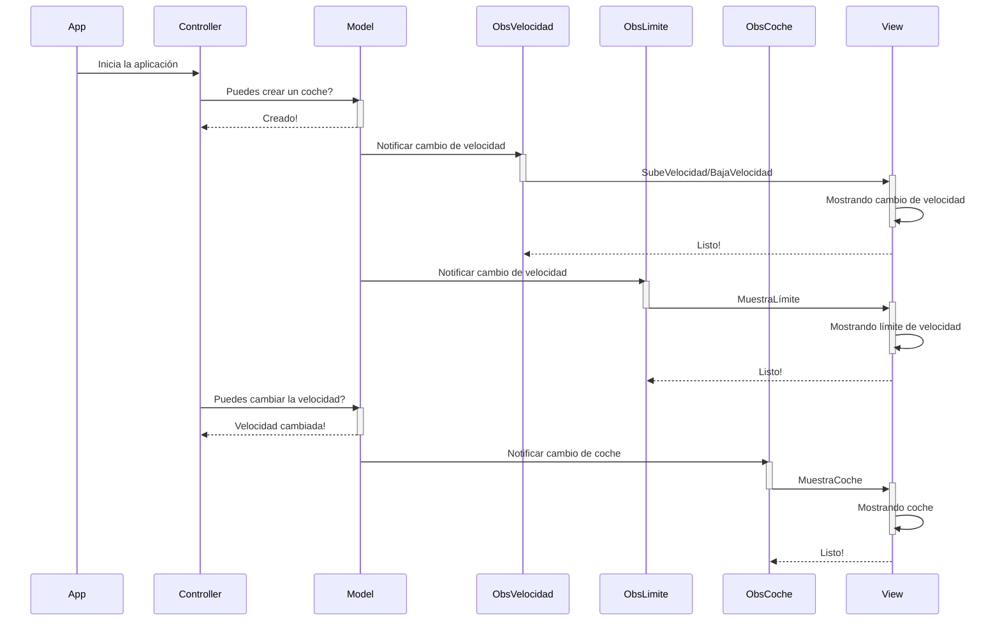
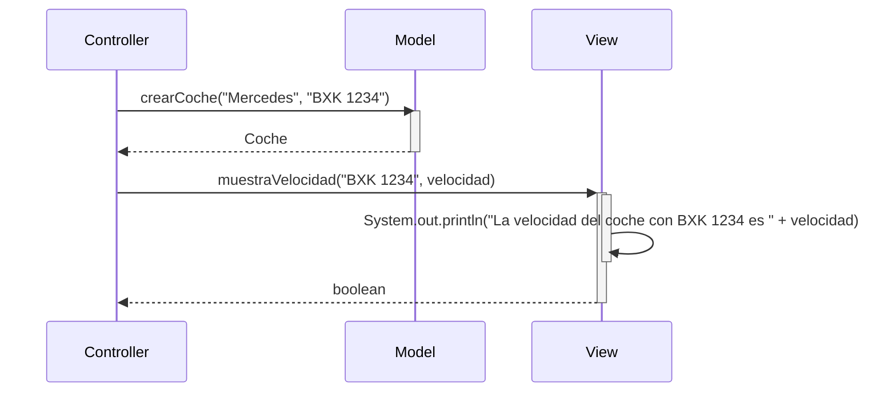

# Tarea: arquitectura MVC

Tarea para implementar arquitectura MVC

Utiliza objetos coches, modifica la velocidad y la muestra

---

## Clases ```Controller``` y ```Model```

- Implementa la clase ```Controller``` y ```Model``` según el diagrama de clases.

- Implementa los métodos ```crearCoche()```, ```getCoche()```, ```cambiarVelocidad()``` y ```getVelocidad()```

- Realiza los test necesarios para comprobar que funcionan correctamente

### Diagrama de clases:

```mermaid
classDiagram
    class Coche {
        String: matricula
        String: modelo
        Integer: velocidad
        Integer: previousVelocidad
        +getMatricula()
        +getModelo()
        +getVelocidad()
        +getPreviousVelocidad()
    }

    class Model {
        ArrayList~Coche~: parking
        +crearCoche(String, String)
        +getCoche(String): Coche
        +cambiarVelocidad(String, Integer)
        +getVelocidad(String): Integer
        +addObserver(Observer)
        +notifyObservers()
        +setObsCoche(Observer)
        +notifyObsCoche(Coche)
    }

    class View {
        +muestraVelocidad(String, Integer)
        +muestraTodosDatos(Coche)
        +subeVelocidad(String, Integer, Integer)
        +bajaVelocidad(String, Integer, Integer)
    }

    class ObsVelocidad {
        +update(Coche)
    }

    class ObsLimite {
        +update(Coche)
    }

    class ObsCoche {
        +update(Coche)
    }

    class Controller {
        -Model: miModel
        +Controller(Model)
        +crearCoche(String, String)
        +cambiarVelocidad(String, Integer)
        +buscarPorMatricula(String): Coche
    }

    class App {
        +main(String[])
    }

    interface Observer {
        +update(Coche)
    }

    Model "1" *-- "1..n" Coche : association
    Model "1" *-- "1" ObsCoche : association
    Model "1" *-- "1..n" Observer : association
    ObsVelocidad ..|> Observer : implements
    ObsLimite ..|> Observer : implements
    ObsCoche ..|> Observer : implements
    Controller "1" *-- "1" Model : association
    Controller "1" *-- "1" View : association
    App "1" *-- "1" Controller : association


```

---

### Diagrama de Secuencia

Ejemplo básico del procedimiento, sin utilizar los nombres de los métodos




El mismo diagrama con los nombres de los métodos

