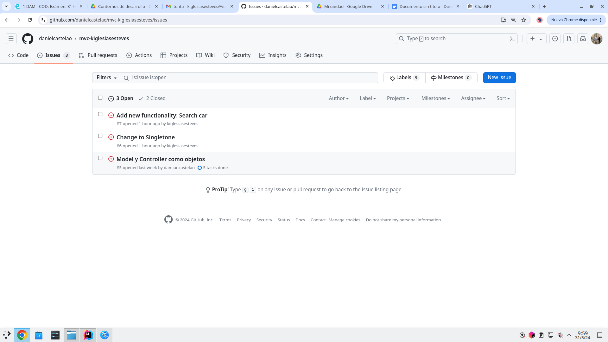
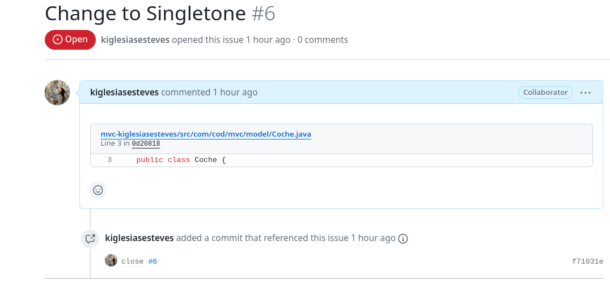
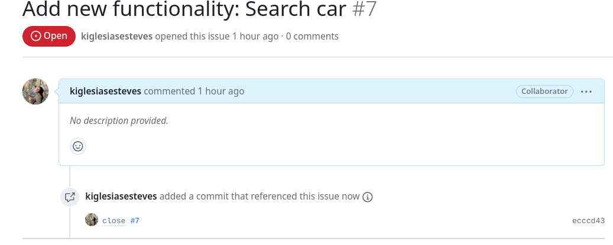

# Proyecto MVC con Observadores

## Descripción del examen del día Viernes 31/5/2024

En esta tarea, se realizaron las siguientes actividades para mejorar el proyecto MVC con observadores:

1. Creación de una nueva rama `ex3Busca`.

2. Apertura de issues en GitHub.

3. Modificación del patrón de diseño de `Coche` a Singleton.

4. Cierre del issue 6  (commit close #6)

6. Creación de un método para buscar coche en Controller.

7. Creación de un método `notifyObsCoche` para notificar solo al observador de coche.

8. Cierre del issue 7  (commit close #7)

9. Documentación de los pasos seguidos en este README.
